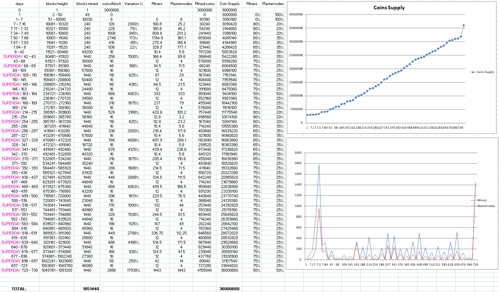

Minerium staging treeMinerium staging treeMinerium staging tree 
=========================

`master:`  

https://MineriumCoin.com

What is Minerium?
----------------

Minerium is a mineable SHA256 crypto currency, a coin which use the bitcoin protocol and blockchain technology.

Here are it's details and specifications:

-- ASICS friendly

-- 51% attacks resistant

-- Adopts Segwit transations

-- Based peer-to-peer cryptocurrency that is forked from Syscoin and Martkist coin

-- Uses the POW (Proof of Work) combined with the Masternodes for more security and passive profits
 
 -Avoiding frozen blockchain - Blocks are fluid

-- Adopts the technique of PrivateSend which allows anonymous transactions
 
 -It mixes all the transactions into multiple parts, everything inside one single transaction.

-- The superblocks have been removed, and instead we implemented a new function called "SuperDay" during which the blocks reward receive an important augmentation of it's amount.
    The goal beeing to give a chance of the new miners joining the project late in time since it started, to mine it themselves,        and not being forced to buy at the exchange.
    Making a mining process less boring, less linear and more interesting.

 
-- Algorithm:        Sha256

-- Block:            1 minute

-- Difficulty:       3 blocks

-- Ticker:           MINR

-- Block size:       6mb

-- P2P Port:         6116

-- RPC Port:         6117

-- Prune height:     1,000,000

-- Max supply:       36,000,660 millon coins

-- Masternodes:         15,000 coins

-- POW Confirmations:   36

-- Instant send Confirmations: 6

-- Masternode Confirmations:   13

-- Premined: 3 million (8.33%)  - for presale - first 200 masternodes  - Tip bots &  giveaway to community - bounties

--                 : Gains will be used for paying servers  such as explorers & website, the developers, 
		    future development for real use of the cryptocurrency in real life - 
		    new exchanges - aiming Binance (see Roadmap)

-- Pre-sale: 50 sats/coin  - 0.0075 for 1 masternode

LINKS:

-- Website: https://mineriumcoin.com

-- Twitter: https://twitter.com/mineriumcoin

-- Discord: https://discord.gg/yPfMCwH

-- Telegram: https://t.me/MineriumCoinOfficial

EXCHANGES:

-- Exchange: https://erex.io

For more information, as well as an immediately useable, binary version of
the Minerium client sofware, see https://mineriumcoin.com/  (downloads section)

License
-------

MineriumCoin is released under the terms of the MIT license. See [COPYING](COPYING) for more
information or see https://opensource.org/licenses/MIT.

Development Process
-------------------

The `master` branch is meant to be stable. Development is normally done in separate branches.
[Tags](https://github.com/minerium/minerium/tags) are created to indicate new official,
stable release versions of Minerium Core.

The contribution workflow is described in [CONTRIBUTING.md](CONTRIBUTING.md).

Testing
-------

Testing and code review is the bottleneck for development; we get more pull
requests than we can review and test on short notice. Please be patient and help out by testing
other people's pull requests, and remember this is a security-critical project where any mistake might cost people
lots of money.

### Automated Testing

Developers are strongly encouraged to write [unit tests](/doc/unit-tests.md) for new code, and to
submit new unit tests for old code.

There are also [regression and integration tests](/qa) of the RPC interface, written
in Python, that are run automatically on the build server.
These tests can be run (if the [test dependencies](/qa) are installed) with: `qa/pull-tester/rpc-tests.py`

Minerium test suites can run by `cd src/test && ./test_minerium`

The Travis CI system makes sure that every pull request is built for Windows
and Linux, OS X, and that unit and sanity tests are automatically run.

### Manual Quality Assurance (QA) Testing

Changes should be tested by somebody other than the developer who wrote the
code. This is especially important for large or high-risk changes. It is useful
to add a test plan to the pull request description if testing the changes is
not straightforward.

Translations
------------

Changes to translations as well as new translations can be submitted to
[Minerium Core's Transifex page](https://www.transifex.com/projects/p/minerium/).

Translations are periodically pulled from Transifex and merged into the git repository. See the
[translation process](doc/translation_process.md) for details on how this works.

**Important**: We do not accept translation changes as GitHub pull requests because the next
pull from Transifex would automatically overwrite them again.

